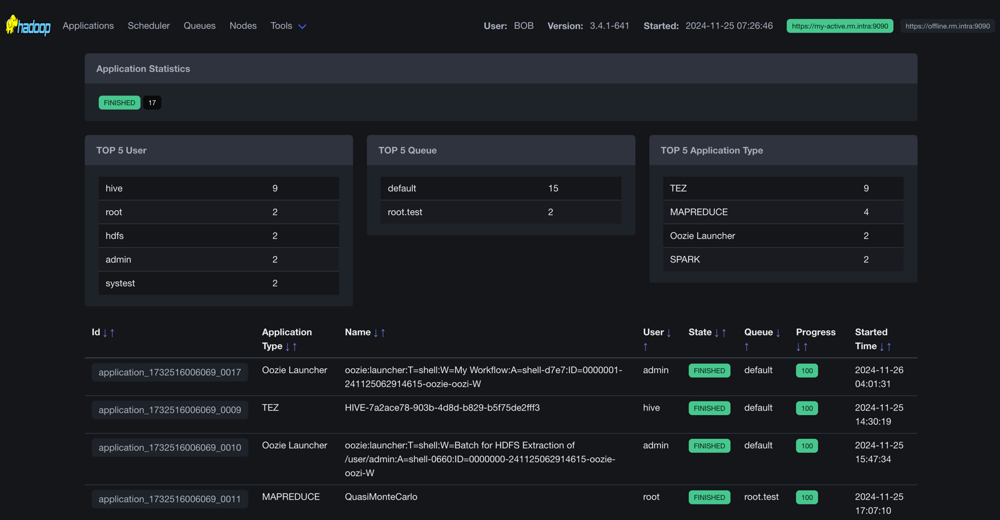

```
                               +===============================================+
                               |xxxxxxxxxxxxxxxxxxxxxxxxxxxxxxxxxxxxxxxxxxxxxxx|
                               |xxxxxxxxxxxxxxxxxxxxxxxxxxxxxxxxxxxxxxxxxxxxxxx|
                               |xxx█████x████xx██████xxx█████x████x█████x████xx|
                               |xx░░███x░███xx░░░░░███x░░███x░███x░░███x░███xxx|
                               |xxx░███x░███xxx███████xx░███x░███xx░███x░███xxx|
                               |xxx░███x░███xx███░░███xx░███x░███xx░███x░███xxx|
                               |xxx░░███████x░░████████x░░███████xx░░████████xx|
                               |xxxx░░░░░███xx░░░░░░░░xxx░░░░░███xxx░░░░░░░░xxx|
                               |xxxx███x░███xxxxxxxxxxxxx███x░███xxxxxxxxxxxxxx|
                               |xxx░░██████xxxxxxxxxxxxx░░██████xxxxxxxxxxxxxxx|
                               |xxxx░░░░░░xxxxxxxxxxxxxxx░░░░░░xxxxxxxxxxxxxxxx|
                               |xxxxxxxxxxxxxxxxxxxxxxxxxxxxxxxxxxxxxxxxxxxxxxx|
                               |xxxxxxxxxxxxxxxxxxxxxxxxxxxxxxxxxxxxxxxxxxxxxxx|
                               +===============================================+
```

# What's this? What's this?

Well, this is **Yet Another YARN UI** for the Hadoop YARN Resource Manager following the original UI (introduced in **2013**) and UI2 (introduced in **2015**).




# But why?

The existing UIs are outdated, relying on older technologies such as:
- **Ember 2.8** (released in **2016**, with LTS support ending in **2017**)
- **jQuery 3.6.0** (released in **2021** and still supported, but aging)

Maintaining these older technologies can be challenging. For example:
- When a CVE (security vulnerability) is discovered in one of UI2's dependencies, fixing it requires an Ember upgrade—a significant effort due to its complexity and age.

Instead of investing resources in upgrading the old UI, I decided to build a **modern, secure, robust, and maintainable** UI for the Yarn Resource Manager.
Fun fact: Check the `em-helpers` dependency in UI2's `package.json` for a glimpse into how outdated dependencies can make maintenance harder.

# Features?

## 🔒 Security

The new UI prioritizes security. For example, take this line from the `SecurityConfig`:

` ... csp.policyDirectives("script-src 'none';"))) ...`

What does this mean?
- **No JavaScript Execution**: This policy prevents the UI from running any JavaScript code.
- **Fewer JS Dependencies**: By not using JavaScript in the UI code, we eliminate many potential sources of CVEs.

## 🛠️ Maintainability

Take a look at the `pom.xml`. How many dependencies are there? Just **7**! If we group all Spring dependencies into one, it's **only 4**.
Why is this important?

**Fewer Dependencies = Easier Maintenance**: Less code to manage and fewer opportunities for vulnerabilities.
**Highly Trusted Libraries**:
- **Spring**: Likely to outlive most other frameworks.
- **Apache Commons, org.json and Guava**: Rock-solid libraries trusted by the developer community.
- **Freemarker**: Good old templating engine under maintenance of Apache community.
- Minimal UI Framework: Using **Bulma.css**, a lightweight and JavaScript-free CSS framework with ~50k GitHub stars, ensures a clean, modern design without unnecessary complexity.

## ⚡ Performance
Why should users directly access the Resource Manager (RM)? This is problematic for two reasons:

1. **Security**: Direct access exposes the RM to potential vulnerabilities.
2. **Load Management**:
   - Imagine the RM is under heavy load.
   - If you use the UI2 for debugging, the RM has to serve jQuery static resources alongside its workload.
   - This can worsen the situation and strain the RM even more.
With YAYU, we offload UI responsibilities from the RM, improving performance and reducing risk.

## 💸 Do You Want to Donate?

Thank you for the thought, but I don’t need financial contributions. Instead, there’s something even more valuable you can help with:

**Getting this code into the official Hadoop repository!**

Your support in reviewing, testing, or advocating for its inclusion would be greatly appreciated and would have a lasting impact on the project.
Together, we can make this a reality for the Hadoop community! 🙌

## 💡 What is Our Philosophy?
1. **KISS** (Keep It Simple, Stupid) – Whatever it takes!
2. **Reduce Dependencies** – Simplicity leads to maintainability.
3. **Order of Priorities**:
   1. It should work.
   2. It should be maintainable.
   3. It should be secure.
   4. Take care of performance (but not at the cost of the above).
